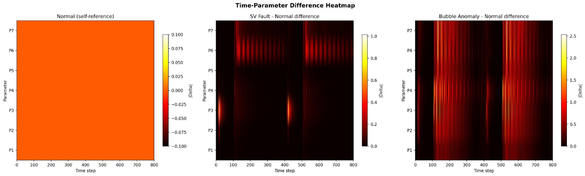
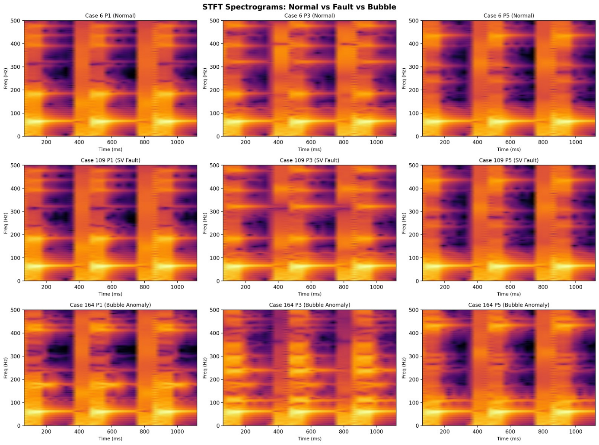
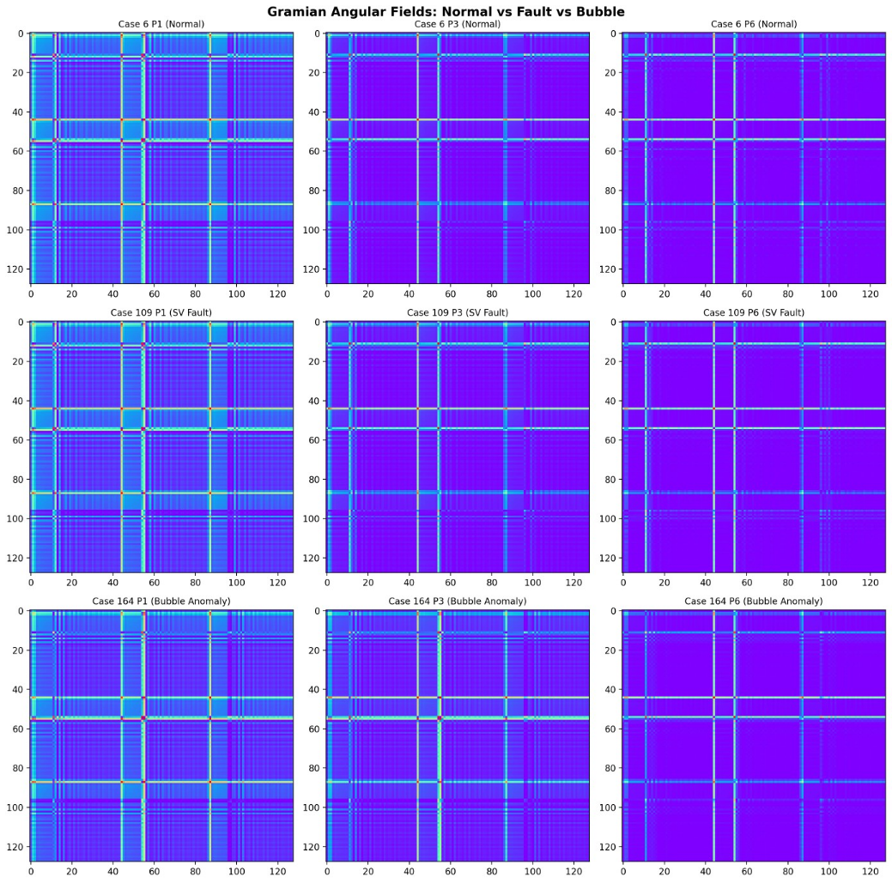

# Note

> 这一部分记录了我在解决整个任务时的思路。

## Dataset & Task Overview

| Task | Type | Classes | Input | Output | Loss |
|------|------|:--:|------|------|------|
| task1 | Binary Classification | 2 | 200×7 window | Normal / Abnormal | BCE |
| task2 | Multi-class Classification | 4 | 200×7 window | Normal / Bubble / SV Fault / Other | CE |
| task3 | Multi-class Classification | 9 | 200×7 window | Bubble Position (None / BP1-7 / BV1) | CE |
| task4 | Multi-class Classification | 5 | 200×7 window | Faulty Valve (None / SV1-4) | CE |
| task5 | Regression | — | 200×7 window | Opening Ratio ∈ [0,100] | Anchor + Huber |

| | Train | Test |
|--|:--:|:--:|
| Cases | 177 | 46 |
| Spacecraft | SC1(59), SC2(59), SC3(59) | SC1(23), **SC4(23)** |
| task5 values | {0, 25, 50, 75, 100} | Continuous {5,22,24,44,46,70,76,94,95,98,100} |

**Key Difficulty**: Task5 training labels are 5 discrete values, but test labels span continuous unseen values from a never-before-seen spacecraft type.

---

前面的任务 1~4 是比较简单的。队友复现了获奖作品的做法——**高斯滤波**增强数据、**TSFRESH** 特征提取、**PCA** 降维、**XGBoost** 分类——轻松实现了满分。

但没能复现出获奖作品在第五问的高精确度。

首先让我们直观地看看为什么 task5 是困难的：

**Evidence: 训练-测试分布鸿沟**

```
Training:   ●    ●    ●    ●    ●
            0   25   50   75   100     (5 discrete points)

Test SC1:   ·  ·        ·       ·  ·
            5 22       46      76  98  (unseen values)

Test SC4:      ·  ·     ·   ·  · ·
              24 44    70  94 95       (unseen spacecraft + unseen values)
```

测试集含 10 个从未在训练中出现的连续值，且分属两个动力学完全不同的航天器型号。

我们查询榜单前列的作品，几乎都是从物理模型本身出发进行数值求解——精准，但略失我意。我并不清楚阀门开度的物理模型及其背后隐藏的流体知识，因此想要完成这项任务，只能依靠仅有的机器学习知识。

但少量的数据让「学习」本身就已经很困难，更遑论迁移到未出现过的 spacecraft 和阀门开度上。

---

## 一个关键的视角：把时序数据看作图像

在动手设计模型之前，还有一个想法越来越强烈地抓住了我：阀门/航天器的遥测数据，本质上也许不该被当作「一维的信号」，而更像是一幅「图像」。

一个窗口本来就是 7 个参数 × 200 个时间步的二维结构，把它画成热力图，就是一张现成的图像：



更进一步，把一维时序投影到二维平面，能暴露出肉眼难以直接看出的结构：

- **STFT 谱图**——把信号展开到「时间 × 频率」平面上，故障特征会以特定频带、特定时刻的形式显现出来：

  

- **格拉姆角场（Gramian Angular Field, GAF）**——把时序编码到极坐标，再求 Gramian 矩阵，得到一张保留时序相关性的图像：

  

既然数据「看起来像图片」，那么用擅长处理图像的 **CNN** 来做特征提取就是顺理成章的选择；图像领域里那些成熟的数据增强技巧（多尺度、多视角），也就有了迁移过来的依据。

这正是后面 **Idea 1 选择 CNN**、**Idea 2 借鉴 GoogLeNet 做多尺度增强** 的出发点之一。

## Idea 1

由于我同时在学习机器人学，并且正在读 NVIDIA 发表的 *"GR00T N1: An Open Foundation Model for Generalist Humanoid Robots"*。其中构建的认知模型包括：**System 1** —— Diffusion Transformer (DiT) 作为小脑进行高频控制；以及 **System 2** —— VLA 中的 VL 模块进行低频的高层语义理解。这种优美的架构立刻占据了我的想象力，我迫不及待地想要借鉴这份优秀的想法。

如果把为阀门进行故障诊断看作一项认知过程，把 task5 当作最终要得到的「知识」，那么前面的 task1~4 就自然而然地可以充当一种「直觉」。或许我可以先通过 task1~4 进行简单的训练，学到一些语义知识，再用于 task5 的预测中（或许还可以与 raw data 进行 concat，这里借鉴了何凯明老师 ResNet 中的思想），喂给「模型大脑」进行深度学习。

当然，现有数据并不足以支持 Transformer 级别的训练。于是我降低复杂度，选择参数量较小的 CNN 作为特征提取的主体，分别构建了「小脑」S1 与「大脑」S2：

1. **S1（小脑 / 快）**：主要由一个预训练得到的 94K 参数 **SSL Encoder**，以及一个可学习的 3K 参数 **Raw CNN** 组成。二者提取特征后 concat 得到 `f1`，再经 **MHA** 预测 task1 并简单调参。
   - 这里的预训练使用了对比学习，损失函数为 **NT-Xent Loss**，主要是为了抓住时序特征。

2. **S2（大脑 / 慢）**：首先是一个 94K 可训练的 CNN，其特征与 `f1` 进行 concat，再过两遍 **MHA**，得到的特征 `z` 直接用于 task2~4 的学习。

## Idea 2

起先，模型复杂度上来之后结果并没有起色。我认为还是数据量不足的问题——显然从不到 200 多条时序数据中抽取有用信息还是过于困难，必须进行数据增强。

一个偶然的机会，我想到了 **GoogLeNet**。我突然意识到，「用不同 Kernel Size 并行提取多尺度特征」的思想也可以迁移过来。为了扩充样本，我构建了两类抽取器：

- 一类是**固定步长** `[1, 2, 3, 5, 7]`
- 另一类是**随机步长** `random U(1, 10)`

将 177 条数据扩充为 3276 个训练窗口，并保留对应数据的标签，实现了大幅度数据增强。

## Idea 3

当然，仅仅有数据层和特征提取层的创新好像还有些不够，或许可以尝试全流程的设计。于是我注意到了预测头的结构。

如果仅仅使用传统的单目标优化，会面临信息损失和「学不动」的情况：因为训练给定值是离散的 `{0, 25, 50, 75, 100}`，而优化目标是连续的 `{5, 22, 46, 76, 98, 24, 44, 70, 94, 95}`。

或许我们可以把这五个离散值设为 **anchor**，学习五个偏移量 **δi**，再根据 anchor 与偏移量得到的结果进行**加权平均**，最终得到 task5 的预测值。在这个过程中，δi 的变化更明显，对参数的优化效果也更明显。

---

### Key Equations

**Z-score归一化**

$$\tilde{x}_t^{(i)} = \frac{x_t^{(i)} - \mu^{(i)}}{\sigma^{(i)} + \epsilon}, \quad \mu^{(i)} = \frac{1}{T}\sum_{t=1}^{T}x_t^{(i)}, \quad \sigma^{(i)} = \sqrt{\frac{1}{T}\sum_{t=1}^{T}(x_t^{(i)}-\mu^{(i)})^2}$$

**SimCLR NT-Xent损失**

$$\mathcal{L}_{SSL} = -\frac{1}{2B}\sum_{i=1}^{B}\left[\log\frac{e^{\text{sim}(z_i,z_i^+)/\tau}}{\sum_{j\neq i}e^{\text{sim}(z_i,z_j)/\tau}} + \log\frac{e^{\text{sim}(z_i^+,z_i)/\tau}}{\sum_{j\neq i}e^{\text{sim}(z_i^+,z_j)/\tau}}\right]$$

其中sim(a,b)=a·b/(|a||b|)，τ=0.1。

**多头自注意力（MHA）**

$$\text{MHA}(Q,K,V) = \text{Concat}(head_1,\ldots,head_h)W^O$$

$$head_i = \text{Attention}(QW_i^Q, KW_i^K, VW_i^V) = \text{softmax}\left(\frac{QW_i^Q(KW_i^K)^T}{\sqrt{d_k}}\right)VW_i^V$$

本架构中Q=K=V（Self-Attention），h=4。

**锚点回归**

$$\hat{y} = \sum_{i=1}^{5} w_i \cdot (a_i + \delta_i)$$

$$w = \text{softmax}(\text{Linear}_{cls}(hu')), \quad \delta_i = \text{Linear}_{head,i}(hu')$$

其中{a_i} = {0, 25, 50, 75, 100}。

**总损失函数**

$$\mathcal{L} = \mathcal{L}_{BCE}^{t1} + 1.5\mathcal{L}_{CE}^{t2} + \mathcal{L}_{CE}^{t3} + \mathcal{L}_{CE}^{t4} + 0.5\mathcal{L}_{CE}^{anc} + 2.0\mathcal{L}_{Huber}^{t5}$$

---

## 反思

观察训练图像，十分令人欣慰。

后面又进行了消融实验。尽管一定程度证明了这些 idea 的有效性，但我仍然保有一份怀疑：不同模型的性能极限可能并不在同一组超参数处取到，所以「控制变量」的意义或许不大？因此我只能通过「cheat」的方式——用 test 集在后台监视模型表现，进一步统计其最优性能。

## AI 声明

作者并不是计算机或 AI 专业的学生，因此代码部分为 AI 辅助编写：我使用 Claude Code 框架，接入 DeepSeek 的 API（V4.1 flash & V4 pro 模型）。但其中涉及到的 ideas 确实是作者本人苦思所得。

## 参考文献

1. NVIDIA. *GR00T N1: An Open Foundation Model for Generalist Humanoid Robots*. 2025.
2. Szegedy et al. *Going Deeper with Convolutions* (GoogLeNet). CVPR 2015.
3. He et al. *Deep Residual Learning for Image Recognition* (ResNet). CVPR 2016.
4. Vaswani et al. *Attention Is All You Need*. NeurIPS 2017.
