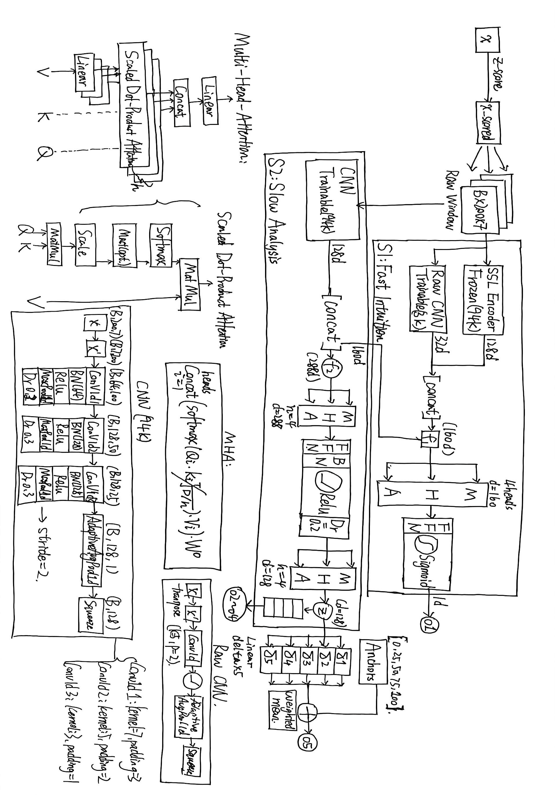

# Spacecraft Multi-Task Fault Diagnosis with Asymmetric Dual-Channel Architecture

[](https://www.python.org/)
[](https://pytorch.org/)
[](https://developer.nvidia.com/cuda-toolkit)

Official implementation of **ComboV2_MHA**: an asymmetric dual-channel architecture with SSL pretraining and multi-head attention for multi-task spacecraft fault diagnosis under domain shift.

## Key Results

| Task | Metric | CV | **Test** |
|------|--------|:--:|:--:|
| task1 | Binary Accuracy | 0.968 | **0.935** |
| task2 | 4-class Accuracy | 0.960 | **0.783** |
| task3 | 9-class F1 (macro) | 0.811 | — |
| task4 | 5-class F1 (macro) | 0.852 | — |
| task5 | R² (regression) | — | **0.940** |
| task5 (SC1) | R² | — | **0.935** |
| task5 (SC4) | R² | — | **0.949** |

**SC4 is a spacecraft type never seen in training — the model achieves near-perfect domain generalization.**

## Key Innovations

1. **Z-score normalization** — removes baseline *and* amplitude-scale differences across spacecraft types, laying the foundation for SC4 domain generalization (the single largest gain in the project: SC4 R² −0.02 → 0.648).
2. **SimCLR SSL pretraining** — contrastive pretraining on 223 unlabeled sequences gives the encoder a transferable "temporal prior" for oscillatory systems (task5 R² 0.60 → 0.71).
3. **Asymmetric dual-channel (fast/slow)** — the core architectural idea: a frozen SSL-pretrained *fast* channel (S1) and a randomly-initialized *slow* channel (S2) provide complementary feature diversity, echoing Kahneman's dual-process theory.
4. **Triple multi-head attention** — three MHA layers (S1, fusion, output) each independently refine the features (task5 R² 0.774 → 0.940).
5. **Anchor regression** — coarse interval classification + fine offset refinement turns task5 from a failed direct regression (R² < 0.01) into a success (R² 0.940).

> [!NOTE]
> **The full design rationale and thought process (in Chinese) is documented in [Note.md](Note.md).**
>
> The core value of this project is how it adapts ideas from classic papers (GR00T N1, GoogLeNet, ResNet, *Attention Is All You Need*) — the reasoning behind every design choice is recorded there.

## Architecture



*Note: this diagram is a placeholder and will be redrawn with professional tools.*

## Project Structure

```
├── README.md
├── Note.md                           # Design rationale & thought process (Chinese)
├── LICENSE
├── requirements.txt
├── configs/
│   └── large.yaml                    # Active configuration
├── src/
│   ├── data/                         # Data loading, augmentation, labels
│   ├── models/                       # Encoders, heads, dual channel, prototypes
│   ├── pretrain/                     # SimCLR, MAE, dual SSL, BERT-MLM
│   ├── training/                     # Trainer, losses, metrics
│   └── utils/                        # Config loader
├── scripts/
│   ├── pretrain_ssl.py               # SSL pretraining (SimCLR 300ep)
│   ├── combov2.py                    # Baseline: no MHA
│   ├── combov2_mha.py                # ★ Final model: triple MHA
│   ├── dual_ssl.py                   # Ablation: Dual Channel + SSL
│   └── viz_augmentation.py           # Augmentation visualization
├── models/                           # Saved weights (.pt)
│   ├── cross_ssl.pt                  # SSL-pretrained encoder
│   └── final/                        # Final trained checkpoints
├── results/
│   └── final_results.json            # Final test-set metrics
└── figures/
    ├── architecture.jpg              # Architecture diagram
    ├── time_parameter_heatmap.png    # Valve data as an image (heatmap)
    ├── stft_spectrograms.png         # Time-frequency spectrogram
    └── gramian_angular_fields.png    # Gramian Angular Field (GAF)
```

## References

1. NVIDIA. *GR00T N1: An Open Foundation Model for Generalist Humanoid Robots*. 2025.
2. Szegedy et al. *Going Deeper with Convolutions* (GoogLeNet). CVPR 2015.
3. He et al. *Deep Residual Learning for Image Recognition* (ResNet). CVPR 2016.
4. Vaswani et al. *Attention Is All You Need*. NeurIPS 2017.

## Citation
If you use this work, please cite:
```
[Paper Title — TBD]
```

## License
This project is licensed under the [MIT License](LICENSE).
